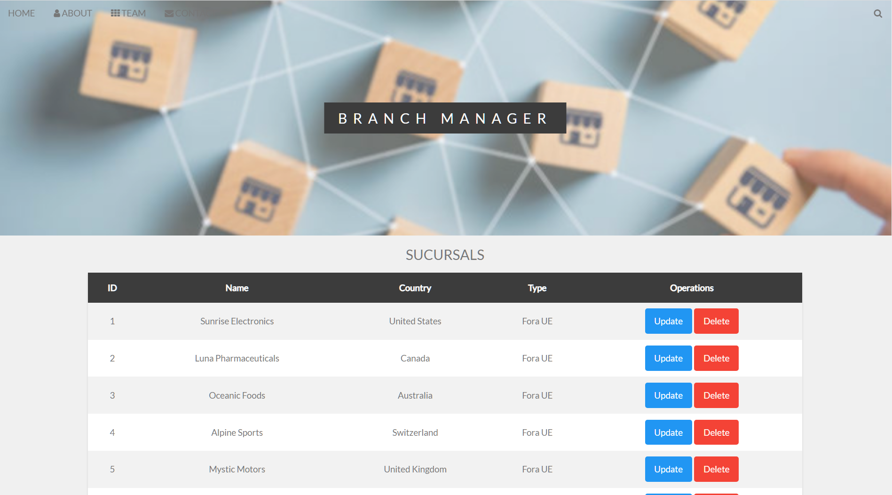
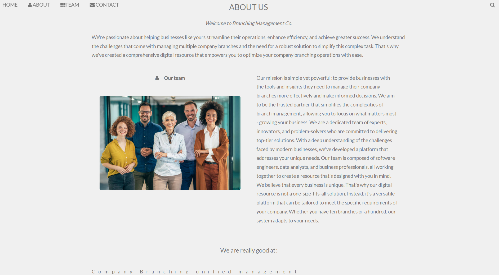
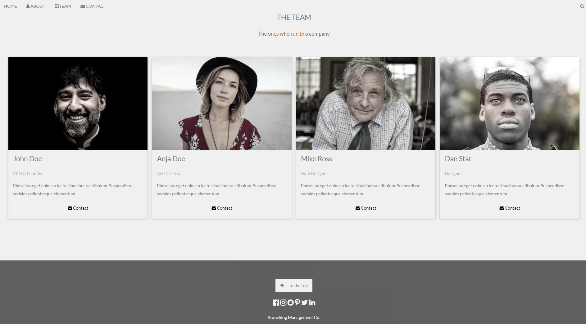
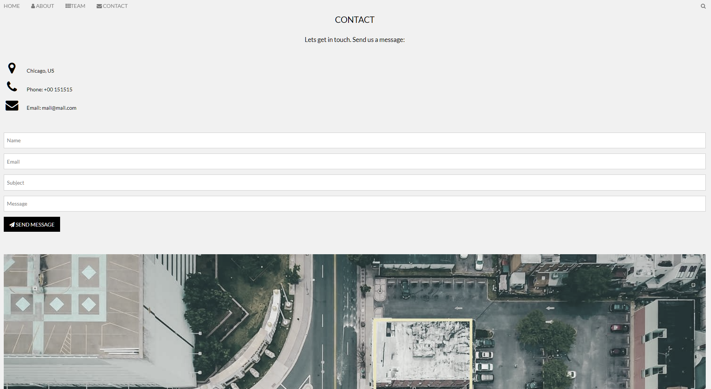

# Web App CRUD with SQL (SpringBoot - Thymeleaf - W3)

This is web app made for managing company branches (creating, updating and deleting them). Has some generic pages to round the professional aesthetic and it could be worked on for much more (not all forms and buttons work). In technical terms, the project disposes of two controllers, one as an ApiREST controller and another one for the web endpoints. Thymeleaf and W3 framework where used for the frontend (html, css and some JavaScript) and Java Springboot for the backend.

## HOME

## ABOUT

## TEAM

## CONTACT

