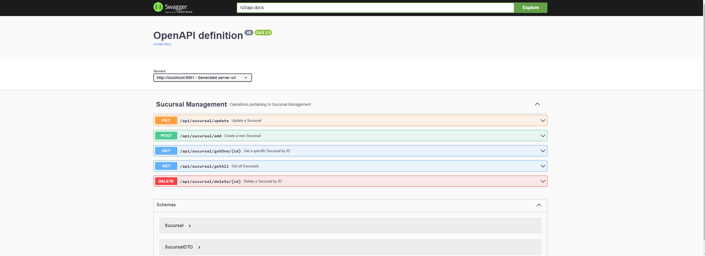
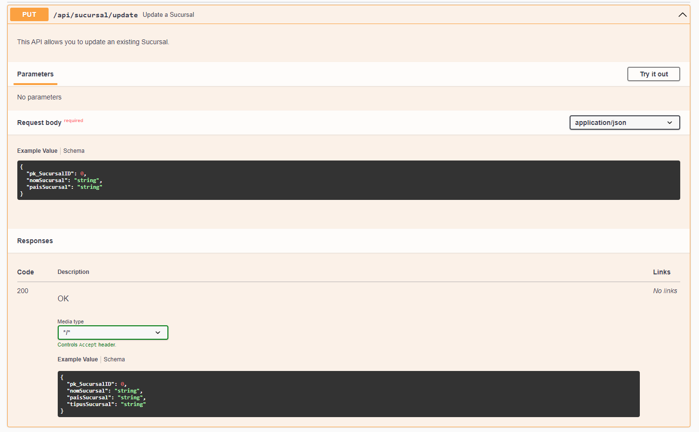
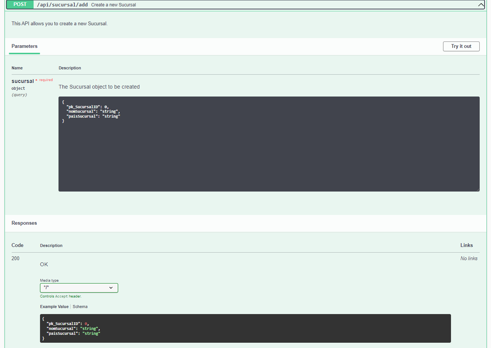
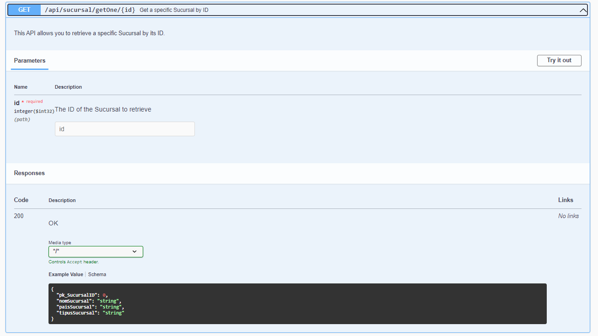
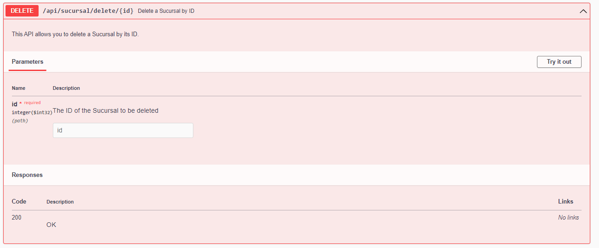

# Api REST CRUD with SQL (SpringBoot - Swagger)

This is an API REST for managing company branches (creating, updating and deleting them) created with SpringBoot and an SQL db and Swagger was used as ui.

## PUT

## POST

## GET

## DELETE

