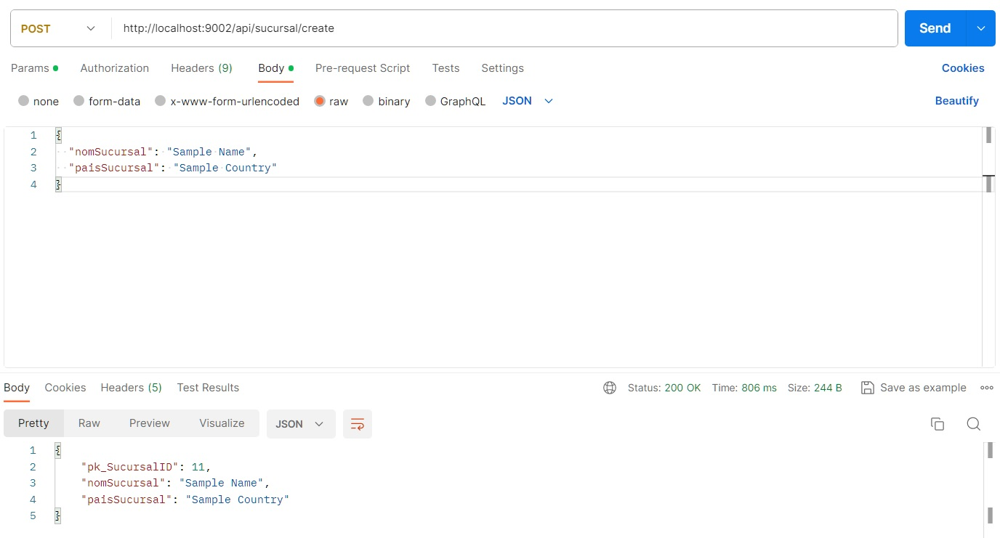
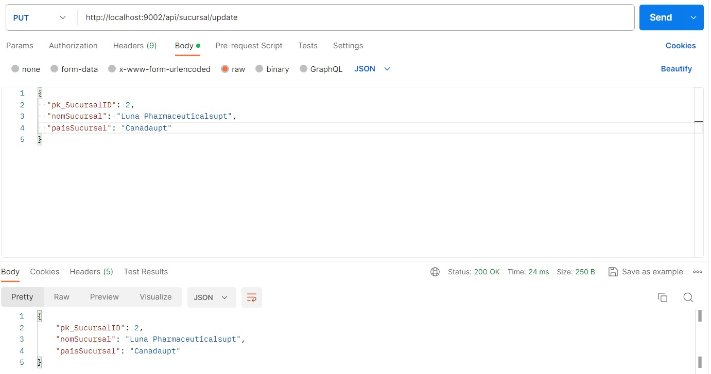
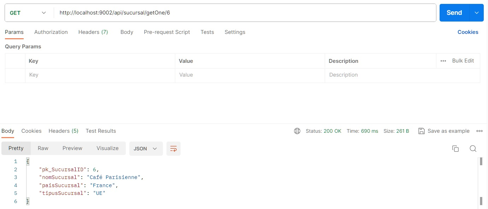
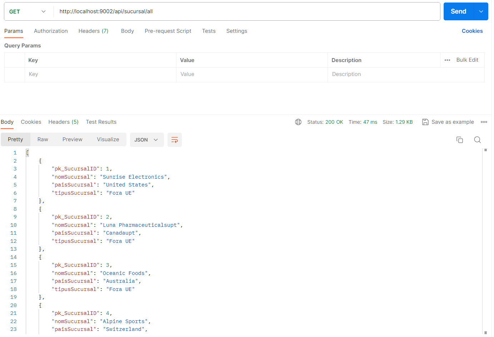

# Api client to Api Server (SpringBoot - WebClient)

Reactive Api built using Spring Webflux and WebClient to send requests to the Api in s05t01n02.

## CREATE

## UPDATE

## Get One

## GET All

